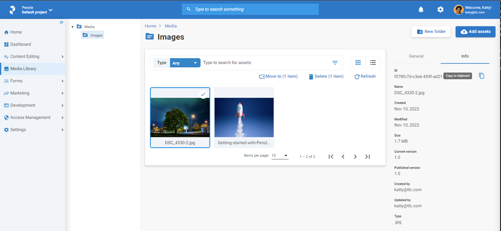

## **Assets**

The Penzle Assets give you a place to keep visual files like Images, PDF files, Google or Microsoft Office Documents, and other business assets. All of these will add visual value to your business.

The primary purpose of the asset library is to hold all of the visual content that Penzle will host them, as well as to create paths for the related files to make sure that no images or links get broken. We store blob files using cutting-edge technology from Azure Cloud, so you don't have to worry about their safety.

 The Penzle.NET SDK has a set of features that can help you with both form delivery and asset management. This will save you time and effort while you are starting building a new app even mobile or web. In the next couple of sections, you'll find how to manage with assets using SDK.

 ### **Models**
As part of Penzle.NET SDK, we offer an asset management models that you can use to manage the content of your assets more efficiency.

 ```csharp
namespace Penzle.Core.Models;

public class Asset
{
    public string Url { get; set; }
    public string AssetId { get; set; }
    public Guid? WorkflowId { get; set; }
    public AssetMimeType AssetMimeType { get; set; }
    public List<Tag> Tags { get; set; }
    public string Id { get; set; }
    public string Name { get; set; }
    public string Description { get; set; }
    public DateTime CreatedAt { get; set; }
    public DateTime ModifiedAt { get; set; }
    public string Type { get; set; }
    public int Size { get; set; }
}
```

 ```csharp
namespace Penzle.Core.Models;

public class AssetMimeType
{
    public List<string> Type { get; set; }
    public string Extension { get; set; }
}

```

We implemented the technology of AI to recognize what content is present in your visual content, such as images. The tags are automatically generated by the Penzle System, and in the future, they can be used as a reference for searching content. Additionally, you can add any custom tags that you choose. The model for tag you can find in namespace `Penzle.Core.Models`

```csharp
namespace Penzle.Core.Models;

public sealed class Tag
{
    public Guid Id { get; set; }
    public string Name { get; set; }
}
```

 ### **Get a asset collection**

 This SDK lets you get a collection of all the assets that are available. The response from the asset management API is a paginated list of up to 100 items. You must give a minimum key for API read to get access to a resource. Thre is C# example how to use it.

```csharp
using Penzle.Core;
using Penzle.Core.Models;

// Create a new instance of the Penzle API client using Factory method ans passing API address and API key.
var managementPenzleClient = DeliveryPenzleClient.Factory(baseAddress: uri, apiDeliveryKey: apiKey, apiOptions: options =>
{
    options.Project = "main"; // Define the project name which you want to use.
    options.Environment = "default"; // Define the environment name which you want to use for the project.
});

var query = QueryAssetBuilder.Instance;
var assetCollection = await managementPenzleClient.Asset.GetAssets(query: query, cancellationToken: CancellationToken.None);

// Print the response of asset collection which is served in pagination list to the console.
Console.WriteLine(value: assetCollection.HasNextPage); //Returns true if the superset is not empty and PageNumber is less than or equal to PageCount and this is not the last subset within the superset.
Console.WriteLine(value: assetCollection.HasPreviousPage); //Returns true if the superset is not empty and PageNumber is greater than or equal to 1 and this is not the first subset within the superset.
Console.WriteLine(value: assetCollection.PageIndex); //Returns the current page number.
Console.WriteLine(value: assetCollection.PageSize); //Returns the number of items in the current page.
Console.WriteLine(value: assetCollection.TotalCount); //Returns the total number of items in the superset.
Console.WriteLine(value: assetCollection.TotalPages); //Returns the total number of pages in the superset.
Console.WriteLine(assetCollection.Items); // Returns the collection of Penzle.Core.Model.Asset in the current page.
```

> ⚠️ An increased page size while pulling the asset will reduce the number of calls to the API endpoint but double the quantity of data provided for each API call. Please keep this in mind when defining pageSize, since it could affect performance and the end-user experience.

 ### **Get a single asset**

 In the scenario that you need to return a single asset, you can do so by using the asset unique id. Using CMS, the Id can be located quickly and without much difficulty, just like it is shown on the screenshot in the upper-right corner of the information section.

 

There is an example of how to do this in C#:

 ```csharp
using Penzle.Core;
using Penzle.Core.Models;

 // Create a new instance of the Penzle API client using Factory method ans passing API address and API key.
var managementPenzleClient = DeliveryPenzleClient.Factory(baseAddress: uri, apiDeliveryKey: apiKey, apiOptions: options =>
{
    options.Project = "main"; // Define the project name which you want to use.
    options.Environment = "default"; // Define the environment name which you want to use for the project.
});


var assetId = new Guid(g: "F078FC7D-C3E6-459F-AD21-D34F71E6195B");
var asset = await managementPenzleClient.Asset.GetAsset(id: assetId, cancellationToken: CancellationToken.None);

// Print the response of returned asset to the console.
Console.WriteLine(value: asset.Id); // Returns the unique identifier of the asset.
Console.WriteLine(value: asset.Name); // Returns the name of the asset.
Console.WriteLine(value: asset.Description); // Returns the description of the asset.
Console.WriteLine(value: asset.Tags); // Returns the tags of the asset and it can be enumerated.
Console.WriteLine(value: asset.CreatedAt); // Returns the date and time when the asset was created.
Console.WriteLine(value: asset.ModifiedAt); // Returns the date and time when the asset was last updated.
Console.WriteLine(value: asset.AssetMimeType); // Returns the mime type of the asset. This is complex object and be access to own properties.
Console.WriteLine(value: asset.Size); // Returns the content length size of the asset.
Console.WriteLine(value: asset.Url); // Returns the url from CDN of the asset.
Console.WriteLine(value: asset.Type); // Returns the type of the asset it can be folder or file.
```
