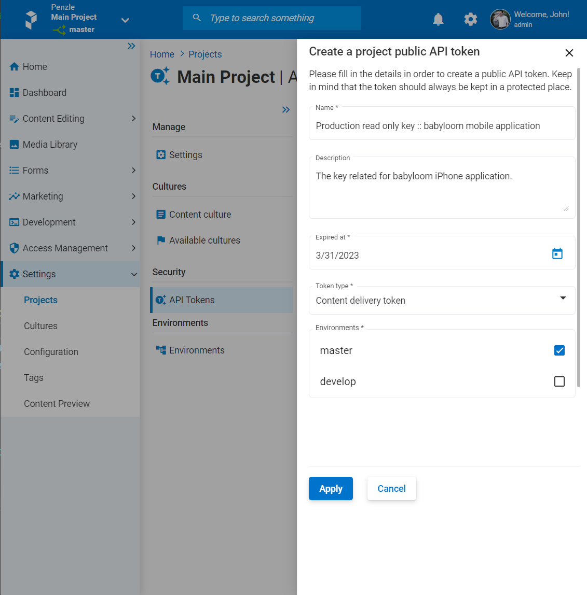
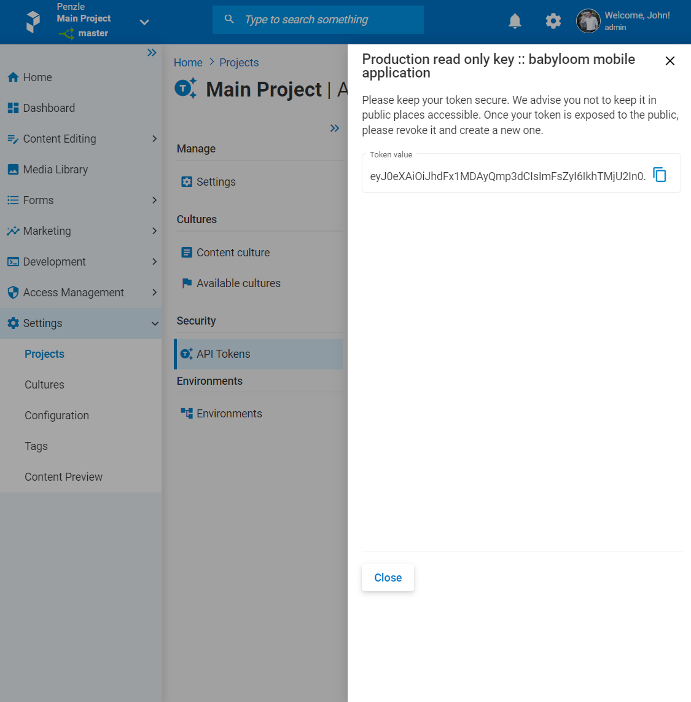

## **Authenticated Access**

You will be required to provide your credentials to the Penzle Client to gain access to your project and carry out
actions. You can generate OAuth keys for Delivery or Management through the administration panel section for a
particular project's settings. Penzle Client is capable of receiving those keys in the configuration in a respective
fashion.

When interacting on behalf of a user, it is highly encouraged to make use of the OAuth Flow because doing so confers not
one but two substantial benefits:

- There is never a need for the owner of the application to store a user's password.
- The user has the option to revoke the token at a later time.

### **OAuth Flow**

You should utilize the OAuth flow if you have an application that needs to connect with the Penzle API on behalf of a
user.

To begin, you will want a Penzle account that should be already open (if not, please follow the instructions on our
website). After successfully logging in, navigate to your Settings and pick the Project tab. After that, select the "API
Tokens" option. See next screen for more details.

After the key has been successfully produced, you are free to copy it and incorporate it into the section of your
application that handles consumption for Penzle Client.

> ⚠️ WARNING: **Once they have been generated, all of the app's keys and tokens need to be kept in a safe place!**
> Please use the **revoke** option in the event that your key has been compromised so that it can be turned invalid.
