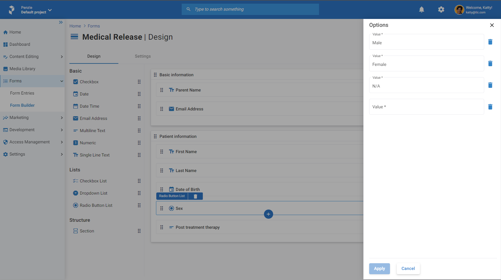

## **Forms**

Forms are used to collect information from users. They are essential components of any online application. This section provides examples of how to create, retrieve, and remove form entries. To understand more about form templates and how to manage them, we recommend visiting our official [documentation](https://docs.penzle.com/).

### **Create a Form Entry**
This Penzle.NET SDK makes it possible to create a new form entry based on a previously specified template with the ability to return a newly created form entry id. To gain access to a resource, you will need a minimum API key for writing and the project and environment. 

Following procedure from recommended with minimum configuration example you can factory the instance and the next example will show how to create entry form.

You can see an example of achieving this in the following C# code.

It is generally advised to create strong type signatures based on your template (like on screeshot), which can be as simply as C# `record` or `class`.



```csharp
internal record Sex
{
    public static Sex Male = new(value: "Male");
    public static Sex Female = new(value: "Female");
    public static Sex Unknow = new(value: "N/A");

    private Sex(string value)
    {
        Value = value;
    }

    private string Value { get; init; }

    public override string ToString()
    {
        return Value;
    }
}
```

```csharp
using System.Text.RegularExpressions;

internal record EmailAddress
{
    private const string EmailPattern = "@^[\\w!#$%&\'*+\\-/=?\\^_`{|}~]+(\\.[\\w!#$%&\'*+\\-/=?\\^_`{|}~]+)*((([\\-\\w]+\\.)+[a-zA-Z]{2,4})|(([0-9]{1,3}\\.){3}[0-9]{1,3}))\\z";

    private EmailAddress(string value)
    {
        Value = value;
    }

    public static EmailAddress Null => new EmailAddress(value: "none@none.com");

    public string Value { get; init; }

    public static implicit operator EmailAddress(string value)
    {
        return Regex.IsMatch(input: value, pattern: EmailPattern) ? new EmailAddress(value: value) : Null;
    }

    public static implicit operator string(EmailAddress value)
    {
        return value?.Value ?? "N/A";
    }
}

```
```csharp
internal class MedicalRelease
{
    public string? ParentName { get; set; }
    public EmailAddress? EmailAddress { get; set; }
    public string FirstName { get; set; } = null!;
    public string LastName { get; set; } = null!;
    public Sex Sex { get; set; } = null!;
    public DateOnly DateOfBirth { get; set; }
    public string? PostTreatmentTherapy { get; set; }
}
```
Once signatures have been created, you can build the root object like in this case "MedicalRelease" and simply call the SKD method.

```csharp
// Create a new instance of the Penzle API client using Factory method ans passing API address and API key.
var managementPenzleClient = ManagementPenzleClient.Factory(baseAddress: uri, apiManagementKey: apiKey, apiOptions: options =>
{
    options.Project = "main"; // Define the project name which you want to use.
    options.Environment = "default"; // Define the environment name which you want to use for the project.
});

// Create a new instance of the form entry.
var medicalRelease = new MedicalRelease
{
    ParentName = "John Doe",
    EmailAddress = "john.doe@penzle.com",
    FirstName = "Jane",
    LastName = "Doe",
    Sex = Sex.Male,
    DateOfBirth = new DateOnly(year: 1975, month: 11, day: 29, calendar: new GregorianCalendar(type: GregorianCalendarTypes.USEnglish)),
    PostTreatmentTherapy = "Use ice packs and take pain medication."
};

// Using created instance of the Penzle API client, you can call the API methods for creating the form entry.
var formId = await managementPenzleClient.Form.CreateForm(form: medicalRelease);

// Print the form id to the console.
Console.WriteLine(value: formId);
```